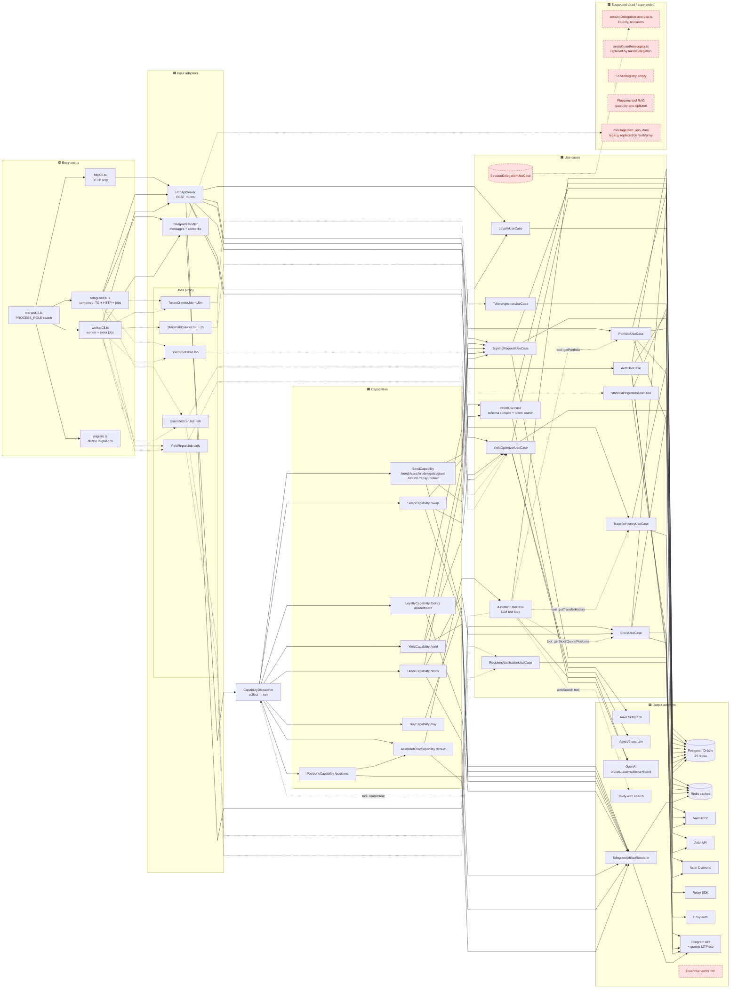
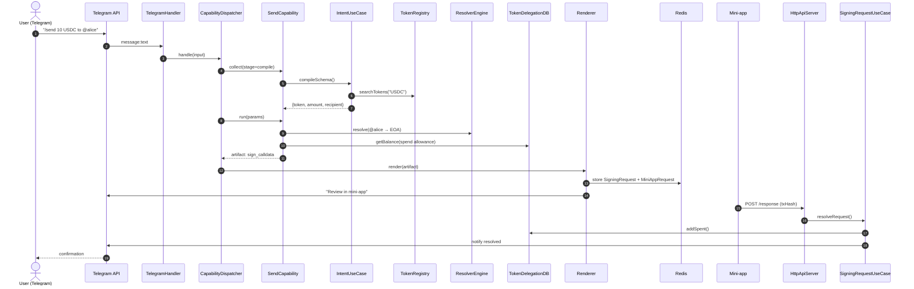
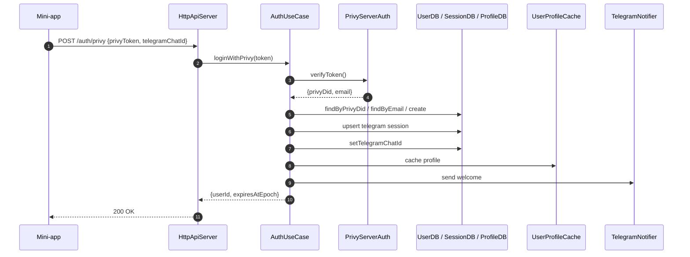
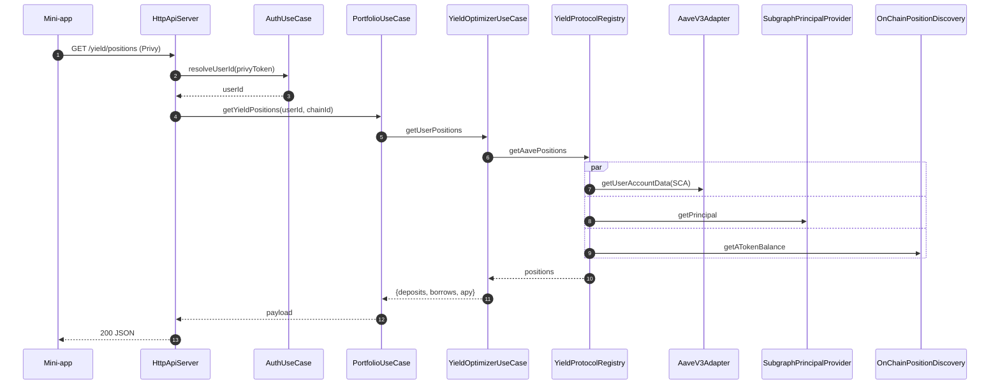
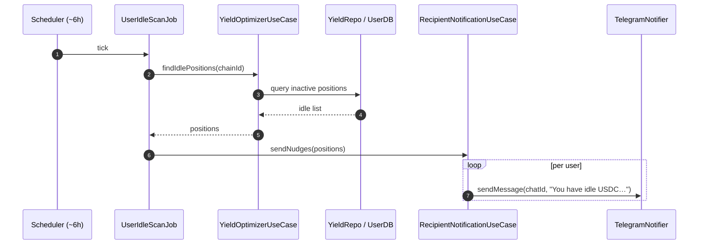

# Backend Flow Map

Each fenced ` ```mermaid ` block is independently pasteable into https://mermaid.live.

Legend (in flowchart):
- 🟢 entry point / process
- 🟦 adapter (input or output)
- 🟧 use-case / capability
- 🟥 suspected dead / superseded code
- dashed edge = job / scheduled trigger

---

## 1. High-level architecture flowchart

Shows every entry point → adapter → use-case/capability → outbound adapter, with dead ends marked.



---

## 2. Sequence: Telegram `/send 10 USDC to @alice`



---

## 3. Sequence: HTTP `POST /auth/privy`



---

## 4. Sequence: HTTP `GET /yield/positions`



---

## 5. Sequence: Worker — UserIdleScanJob → Telegram nudge



---

## 6. Where to look for dead code

| Suspect | Path hint | Why |
|---|---|---|
| `SessionDelegationUseCase` | `src/use-cases/sessionDelegation.usecase.ts` | DI-instantiated only; no production callers — superseded by token delegation flow |
| `aegisGuardInterceptor` | adapter helper | replaced by `tokenDelegations` repo + `SigningRequestUseCase.addSpent` |
| `SolverRegistry` | adapter | empty registry, never resolved |
| Pinecone tool RAG (`PineconeToolIndexService`, `OpenAIEmbeddingService`, `PineconeVectorStore`) | output adapters | gated by API keys; if env unset, never invoked at runtime |
| Telegram `message:web_app_data` legacy auth | `telegram/handler.ts` | replaced by `POST /auth/privy` |
| `/swagger` route | http server | no `swagger.json` served |

Cross-check before deleting: `grep -R "<symbol>" src/` and confirm only DI wiring references it.
